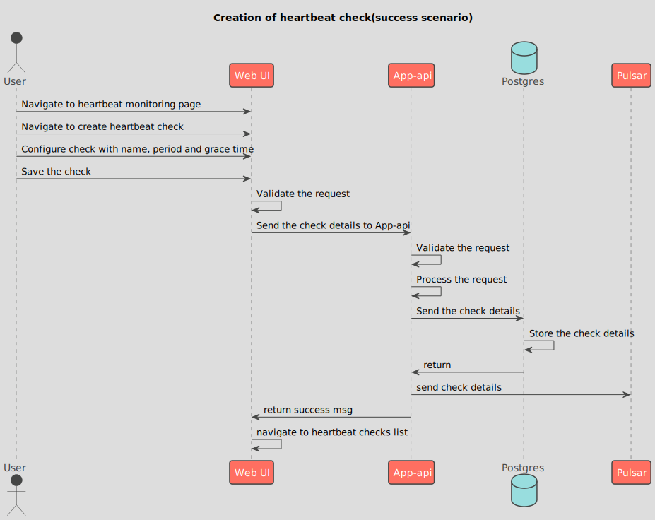
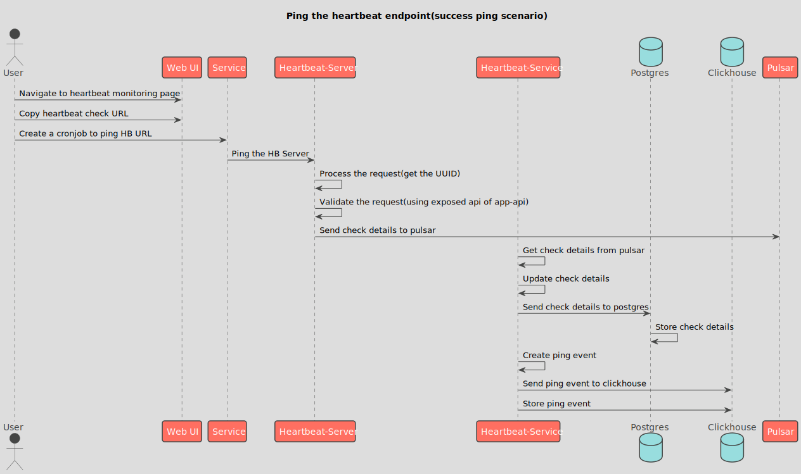

## Sequence diagrams for heartbeat monitoring

### Creation of heartbeat check(success scenario)
<!--
@startuml 01_hb_creation
!theme toy
title Creation of heartbeat check(success scenario)
actor User
participant "Web UI"
participant "App-api"
database    Postgres
participant Pulsar
User -> "Web UI" : Navigate to heartbeat monitoring page
User -> "Web UI" : Navigate to create heartbeat check
User -> "Web UI" : Configure check with name, period and grace time
User -> "Web UI" : Save the check
"Web UI" -> "Web UI" : Validate the request
"Web UI" -> "App-api" : Send the check details to App-api
"App-api" -> "App-api" : Validate the request
"App-api" -> "App-api" : Process the request
"App-api" -> Postgres : Send the check details
Postgres -> Postgres : Store the check details
Postgres -> "App-api" : return
"App-api" -> Pulsar : send check details  
"App-api" -> "Web UI" : return success msg
"Web UI" -> "Web UI" : navigate to heartbeat checks list
@enduml
-->

### Ping the heartbeat endpoint(success ping scenario)
<!--
@startuml 02_success_ping
!theme toy
title Ping the heartbeat endpoint(success ping scenario)
actor User
participant "Web UI"
participant Service
participant "Heartbeat-Server"
participant "Heartbeat-Service"
database    Postgres
database    Clickhouse
participant Pulsar
User -> "Web UI" : Navigate to heartbeat monitoring page
User -> "Web UI" : Copy heartbeat check URL
User -> Service : Create a cronjob to ping HB URL
Service -> "Heartbeat-Server" : Ping the HB Server
"Heartbeat-Server" -> "Heartbeat-Server" : Process the request(get the UUID)
"Heartbeat-Server" -> "Heartbeat-Server" : Validate the request(using exposed api of app-api)
"Heartbeat-Server" -> Pulsar : Send check details to pulsar
"Heartbeat-Service" -> "Heartbeat-Service" : Get check details from pulsar
"Heartbeat-Service" -> "Heartbeat-Service" : Update check details
"Heartbeat-Service" -> Postgres : Send check details to postgres
Postgres -> Postgres : Store check details
"Heartbeat-Service" -> "Heartbeat-Service" : Create ping event
"Heartbeat-Service" -> Clickhouse : Send ping event to clickhouse
"Heartbeat-Service" -> Clickhouse : Store ping event
@enduml
-->

### Ping the heartbeat endpoint(success alert notification scenario)
<!--
@startuml 03_success_alert
!theme toy
title Ping the heartbeat endpoint(success alert notification scenario)
actor User
participant "Service"
participant "Heartbeat-Server"
participant "Heartbeat-Service"
participant Pulsar
User -> Service : Create a cronjob to ping HB URL
Service -> "Heartbeat-Server" : Ping the HB Server
"Heartbeat-Server" -> "Heartbeat-Server" : validate the ping
"Heartbeat-Server" -> "Pulsar" : Send msg to pulsar
"Heartbeat-Service" -> "Heartbeat-Service" : Get the msg from pulsar
"Heartbeat-Service" -> "Heartbeat-Service" : Update the check details and create event
"Heartbeat-Service" -> "Heartbeat-Service" : Update the dbs(postgres and clickhouse)
"Heartbeat-Service" -> "Heartbeat-Service" : Send alert(current check details and ping events) to configured platform for the check whenever check state is updated(except initial up state)
@enduml
-->

// Event (#PING_COUNT | TIMESTAMP | PING_SOURCE | USER_AGENT)
// Event (TIMESTAMP | OLD_STATUS | NEW_STATUS)
