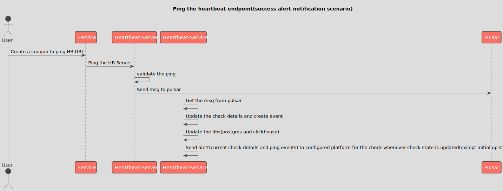

## Sequence diagrams for heartbeat monitoring

### Creation of heartbeat check(success scenario)
<!--
@startuml 01_hb_creation
title Creation of heartbeat check(success scenario)
actor User
participant "Web UI"
participant Bifrost
database    Postgres
User -> "Web UI" : Navigate to heartbeat monitoring page
User -> "Web UI" : Navigate to create heartbeat check
User -> "Web UI" : Configure check with name, period and grace time
User -> "Web UI" : Save the check
"Web UI" -> "Web UI" : Validate the request
"Web UI" -> Bifrost : Send the check details to bifrost
Bifrost -> Bifrost : Validate the request
Bifrost -> Bifrost : Process the request
Bifrost -> Postgres : Send the check details
Postgres -> Postgres : Store the check details
Postgres -> Bifrost : return
Bifrost -> "Web UI" : return success msg
"Web UI" -> "Web UI" : navigate to heartbeat checks list
@enduml
-->

### Ping the heartbeat endpoint(success ping scenario)
<!--
@startuml 02_success_ping
title Ping the heartbeat endpoint(success ping scenario)
actor User
participant "Web UI"
participant Service
participant Bifrost
database    Postgres
User -> "Web UI" : Navigate to heartbeat monitoring page
User -> "Web UI" : Create a heartbeat check
User -> "Web UI" : Copy heartbeat URL
User -> Service : Create a cronjob to ping HB URL
Service -> Bifrost : Ping the bifrost
Bifrost -> Bifrost : Process the request(get the UUID)
Bifrost -> Postgres : Request the check details
Postgres -> Bifrost : return the check details
Bifrost -> Bifrost : Update the check status
Bifrost -> Postgres : Send the check details
Postgres -> Postgres : Store the updated check details
Bifrost -> Postgres : Request the check events
Postgres -> Bifrost : Send the check events
Bifrost -> Bifrost : Update the check events
Bifrost -> Postgres : Send the check events
Postgres -> Postgres : Store the check events
Postgres -> Bifrost : Return
Bifrost -> "Web UI" : Send the updated check and check events
@enduml
-->

### Ping the heartbeat endpoint(success alert notification scenario)
<!--
@startuml 03_success_alert
title Ping the heartbeat endpoint(success alert notification scenario)
actor User
participant "Web UI"
participant Service
participant Bifrost
database    Postgres
User -> Service : Create a cronjob to ping HB URL
Service -> Bifrost : Ping the bifrost
Bifrost -> Bifrost : Process the request(get the UUID)
Bifrost -> Postgres : Request the check details
Postgres -> Bifrost : return the check details
Bifrost -> Bifrost : Update the check status
Bifrost -> Postgres : Send the check details
Postgres -> Postgres : Store the updated check details
Bifrost -> Postgres : Request the check events
Postgres -> Bifrost : Send the check events
Bifrost -> Bifrost : Update the check events
Bifrost -> Postgres : Send the check events
Postgres -> Postgres : Store the check events
Postgres -> Bifrost : Return
Bifrost -> "Web UI" : Send the updated check and check events
Service -> Service : Service crashes due to some reasons
Service -> Service : Not able to ping the the HB URL
Bifrost -> Bifrost : Wait for the ping till period then update the status to "late"
Bifrost -> Bifrost : Wait for the ping till grace time then update the status to "down"
Bifrost -> "Web UI" : Send the check and event details
"Web UI" -> "Web UI" : Update the check and event details
@enduml
-->

